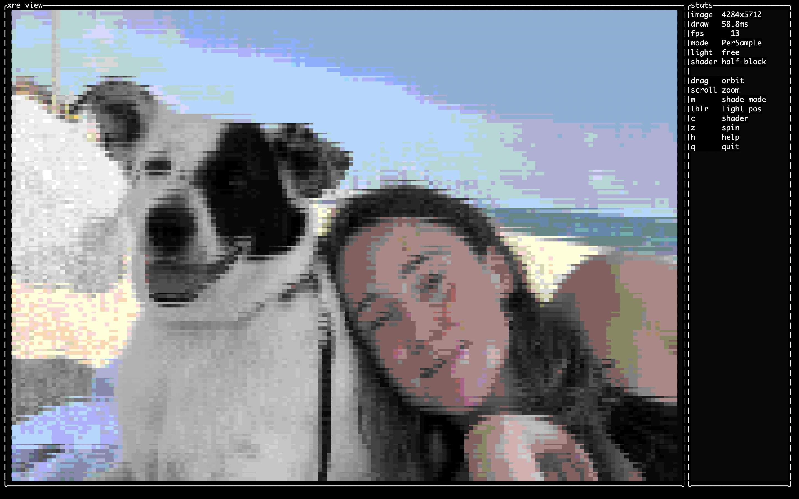
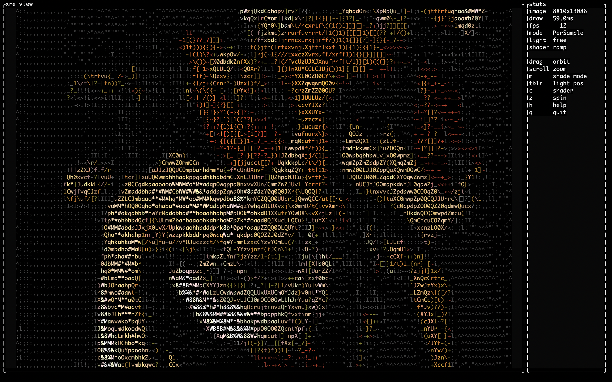

# xRenderEngine


**A lightweight 3D rendering engine and game framework that runs in your terminal.**

xRenderEngine renders real 3D scenes — and full TUI dashboards — as characters, using
**sub-cell sampling** and **shape-vector glyph selection** to get far past the usual
"one character per pixel" ASCII look. It is dependency-minimal, has no async runtime
and no GPU, and degrades gracefully from truecolor down to plain ASCII.

> **Status: pre-0.1, the 4.5 parallelism pass implemented.** The full
> stack is in place and tested: core types + OKLab, the diffed presenter and input
> pump, the TUI toolkit (layout, panels, widgets, themes), the sub-cell software
> renderer (rasterizer, lighting, luminance/shape-vector/Unicode cell shaders) —
> now **row-parallel via rayon** (default-on, byte-identical to serial) — the
> OBJ/MTL loader + scene graph + camera controllers + textures, and the game
> engine (fixed-timestep loop, `hecs` ECS, animation, input mapping, swept
> collision, grid raycaster). Demos: `dashboard`, `spinning-cube`, `rift-fps`,
> and the `xre view` model viewer; the [book](docs/book/) covers it all. Remaining
> for 0.1: the SIMD hot-loop pass and packaging. The full design and roadmap live

## Why it's different


- **Characters are not pixels.** Each terminal cell is rasterized at sub-cell
  resolution (2×4 samples by default) and resolved by a pluggable *cell shader*
  (luminance ramp, 6-D shape vector, half-block, Braille, block-shades).
- **One frame, two engines.** A TUI layer (panels, grids, widgets) and a 3D layer
  (scenes in `Viewport3D` widgets) share one cell buffer and one diffed presenter.
- **Degrade gracefully.** Truecolor → 256 → 16 → ASCII, detected at runtime.
- **Lightweight.** Few dependencies; target release binary < 5 MB, cold start < 50 ms.

## Gallery

Example renders straight out of the terminal:





## Workspace layout

| Crate | Responsibility |
|-------|----------------|
| [`xre-core`](crates/xre-core)     | Math re-exports (glam), `Color`, `Cell`, geometry, errors |
| [`xre-term`](crates/xre-term)     | Terminal backend: raw mode, capabilities, diffed presenter, input |
| [`xre-tui`](crates/xre-tui)       | Panels, grids, layout, widgets, focus, the `Viewport3D` widget |
| [`xre-render`](crates/xre-render) | Software 3D: sample buffers, rasterizer, raycasters, cell shaders |
| 🎻 [`xre-cello`](crates/xre-cello)   | Scene graph, mesh, camera, lights, materials, animation, OBJ/MTL |
| [`xre-engine`](crates/xre-engine) | Game loop, time, input mapping, ECS (hecs), assets |
| [`xre`](crates/xre)               | Facade crate: prelude, feature flags, re-exports |

Plus tools: [`xre-cli`](tools/xre-cli) (the `xre` binary) and
[`glyphgen`](tools/glyphgen) (offline font calibration).

## Build

```sh
cargo build --workspace
cargo test  --workspace
cargo run -p xre-cli -- --help
```

Try the demos (press `q`/`Esc` to quit):

```sh
# TUI dashboard: tabs, gauges, sparklines, scrolling log, command input
cargo run -p xre-tui --example dashboard

# Spinning lit cube + torus in a Viewport3D, beside live text
cargo run -p xre-tui --example spinning-cube

# Playable FPS demo on the grid raycaster (WASD + arrows)
cargo run -p xre-engine --example rift-fps --features grid-raycaster

# Load and orbit an OBJ model; press 'c' to cycle cell shaders
cargo run -p xre-cli -- view assets/cube.obj
cargo run -p xre-cli -- view model.obj --snapshot out.txt   # headless export

# Report the render-pipeline timings; calibrate a font into a glyph ramp
cargo run -p xre-cli -- bench
cargo run -p xre-cli -- glyphgen --font /path/to/Menlo.ttf --out assets/atlas_menlo.rs
```

See [`CONTRIBUTING.md`](CONTRIBUTING.md) for the full lint/test workflow.

## License

Licensed under **Apache-2.0**. See [`LICENSE`](LICENSE).

## Prior art & credits

xRenderEngine reimagines techniques from several terminal-rendering projects. Full
attribution will ship in a `NOTICE` file; notably **Ymael**, **asciimare**,
**Command_Line_3D**, **justMoritz**, the **alexharri** shape-vector article, and
**gemini-engine** (evaluated and rejected as a base; its MIT ear-clip triangulator
is vendored in Phase 3 with attribution).
